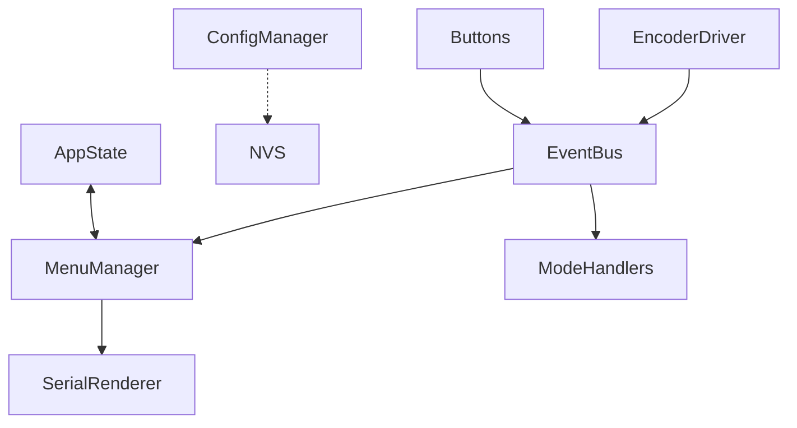

# Architecture Decision Document

_This document builds collaboratively through step-by-step discovery. Sections are appended as we work through each architectural decision together._

## Project Context Analysis

### Requirements Overview

**Functional Requirements:**
The system requires a hierarchical menu system driven by a rotary encoder and buttons. Key architectural drivers include:
- **Display-Agnostic Menu System:** The menu logic must be decoupled from the rendering implementation to support both serial output (MVP) and future OLED displays.
- **Runtime Configuration:** Button behaviors and wheel modes must be configurable at runtime and persisted across power cycles.
- **Dynamic Hardware Support:** The system must handle a variable number of buttons defined via configuration, requiring flexible data structures.
- **Event-Driven Input:** All inputs (encoder, buttons) must be processed via an event queue to ensure responsiveness and non-blocking operation on the single-core ESP32-C3.

**Non-Functional Requirements:**
- **Extensibility:** New wheel modes and button behaviors must be easy to add (Strategy/Command patterns).
- **Responsiveness:** Menu navigation must be immediate (<50ms latency).
- **Persistence:** Configuration must be saved to NVS (Non-Volatile Storage) reliably.
- **Resource Constraints:** Must operate within ESP32-C3 memory limits (400KB SRAM), favoring efficient storage for menu structures.

**Scale & Complexity:**
- Primary domain: Embedded/IoT (C++ / PlatformIO)
- Complexity level: Low-Medium (Brownfield extension)
- Estimated architectural components: ~5-7 core components (MenuManager, DisplayDriver, InputHandler, ConfigManager, ModeManager, EventDispatcher, StorageProvider).

### Technical Constraints & Dependencies

- **Hardware:** ESP32-C3 Super Mini (RISC-V).
- **Framework:** Arduino framework via PlatformIO.
- **Existing Codebase:** Must integrate with existing `EncoderDriver`, `EventDispatcher`, and `EncoderMode` structures.
- **Concurrency:** Single-core architecture necessitates cooperative multitasking (FreeRTOS tasks/queues) rather than parallelism.
- **Memory:** Limited RAM requires careful management of menu trees and display buffers.

### Cross-Cutting Concerns Identified

1.  **Event System:** Central backbone for decoupling input, logic, and output.
2.  **Configuration Management:** Centralized handling of NVS reading/writing for all components.
3.  **State Management:** Tracking global device state (current mode, active menu) accessible to relevant components.
4.  **Display Abstraction:** A unified interface for rendering that all components use, regardless of the physical output device.

## Starter Template Evaluation

### Primary Technology Domain

Embedded/IoT Firmware using PlatformIO Arduino framework for ESP32-C3 Super Mini.

### Starter Options Considered

- PlatformIO standard \`pio project init --board esp32-c3-devkitm-1\`

- Arduino ESP32 HID examples (custom implementation typical).

- No specialized CLI starter for USB HID knob/buttons; brownfield extension preferred.

### Selected Starter: Existing PlatformIO Project (Brownfield Revamp)

**Rationale for Selection:**

Current structure provides foundation (platformio.ini, src/, include/, lib/). Revamp needed for better architecture, code organization, naming conventions, decoupling. Focus on code as build system solid.

**Architectural Decisions Established:**

**Language & Runtime:** C++ with Arduino-ESP32 core.

**Build Tooling:** PlatformIO.

**Storage:** NVS for runtime config persistence.

**Code Organization:** Revamp to strategy patterns for modes/handlers, event-driven dispatch.

**Development Experience:** VSCode + PlatformIO; consider unit tests.

**Note:** First implementation: Refactor existing code per new architecture.

## Core Architectural Decisions

### Decision Priority Analysis

**Critical Decisions (Block Implementation):**
- Event System: FreeRTOS queue-based EventBus (renamed from Dispatcher).
- Config Persistence: NVS with CRC validation/serialization.

**Important Decisions (Shape Architecture):**
- State Management: AppState singleton (thread-safe if multi-task).
- Display Abstraction: IDisplayRenderer interface (render(MenuItem current, std::vector<MenuItem> options)).
- Mode Extensibility: Strategy pattern (HandlerBase, ModeSelector).

**Deferred Decisions (Post-MVP):** OTA updates, advanced power mgmt, full unit test suite (>80% coverage).

### Persistence Architecture (Data)
- NVS: Namespaces per component (config/, modes/). JSON-like serialization. CRC checksum for validation on load. Fallback to defaults on corruption.
- Versioning: Config version in NVS for future migrations.

### Concurrency & Event Handling
- Events: FreeRTOS queue (bounded size to prevent overflow). AppEvent/EncoderInputEvent enums.
- Dispatch: Non-blocking in main loop(). Optional FreeRTOS tasks for peripherals.

### Extensibility Patterns
- Interfaces: IDisplayRenderer, EncoderInputHandlerInterface, EncoderModeHandlerInterface (HandlerBase).
- Naming Revamp: EventBus, ModeSelector, HandlerBase.
- Factories: Dynamic instantiation via config.

### Resource Management
- Memory: Static arrays preferred; avoid new/delete in hot paths.
- CPU: Debounced inputs, efficient polling.

### Testing Strategy
- Unit: Handlers, config serializer (mock NVS).
- Integration: Event flow (mock inputs).
- Coverage: >80% core logic.

### Deployment & Infra
- Flash: PlatformIO upload.
- Debug: Serial output for status.

### Decision Impact Analysis
**Implementation Sequence:**
1. EventBus revamp (rename/dispatch).
2. ConfigManager with NVS/CRC.
3. AppState centralization.
4. IDisplayRenderer (serial impl).
5. HandlerBase/ModeSelector refactor.
6. Menu system integration.

**Cross-Component Dependencies:**
EventBus feeds all; Config loads at boot; State shared via getters.

## Implementation Patterns & Consistency Rules

### Pattern Categories Defined

**Critical Conflict Points:** Naming, file structure, event payloads, error handling, memory mgmt.

### Naming Patterns

**Classes/Structs/Interfaces:** PascalCase (e.g., EventBus, IDisplayRenderer)
**Functions/Methods:** camelCase (e.g., dispatchEvent, renderMenu)
**Variables/Fields:** camelCase (e.g., currentMode, eventQueue)
**Constants:** UPPER_SNAKE_CASE (e.g., MAX_QUEUE_SIZE)
**Files:** PascalCase.h/cpp (e.g., EventBus.h)
**Dirs:** PascalCase (e.g., Event/, Config/)

### Structure Patterns

**Project Organization:**
- include/: Public headers (classes, interfaces)
- src/<feature>/: Feature cpp/impl (src/Event/Dispatcher/)
- lib/: 3rd party libs
- test/: Unit tests parallel to src

**Header Guards:** INCLUDE_GUARD(FEATURE_filename_h)

### Format Patterns

**Event Payloads:** struct EventData { EventType type; union { ... }; }
**Config Serialization:** JSON-like strings in NVS with CRC32.
**Logs:** Serial.printf with levels (DEBUG, INFO, ERROR)

### Communication Patterns

**Event Handling:** EventBus::post(Event), non-blocking dispatch.
**Callbacks:** std::function or interfaces.

### Process Patterns

**Error Handling:** Result enum (OK, ERROR_INVALID_CONFIG), no exceptions.
**Init Sequence:** Boot -> LoadConfig -> InitPeripherals -> MainLoop
**Validation:** CRC on load, defaults fallback.

### Enforcement Guidelines

**All AI Agents MUST:**
- Follow naming exactly
- Use static memory where possible
- No dynamic alloc in ISR/hot paths
- Header doc for public APIs

**Examples:**
Good: class EventBus { void post(const Event& e); };
Anti: class event_bus { void PostEvent(Event e); }

## Project Structure & Boundaries

### Complete Project Directory Structure

```
UtilityButtonsWithKnobUSB/
├── platformio.ini
├── lib/
│   ├── EncoderDriver/
│   └── StatsMonitor/
├── src/
│   ├── main.cpp
│   ├── Helpers/
│   │   └── utils.cpp
│   ├── test/  # colocated
│   ├── AppState.cpp
│   ├── Config/
│   │   └── ConfigManager.cpp
│   ├── Event/
│   │   └── Dispatcher/
│   │       └── EventBus.cpp
│   ├── Menu/
│   │   ├── MenuManager.cpp
│   │   └── SerialRenderer.cpp
│   └── Mode/
│       ├── ModeSelector.cpp
│       └── Handlers/
│           ├── HandlerBase.cpp
│           ├── ScrollHandler.cpp
│           └── VolumeHandler.cpp
├── docs/
│   └── api/  # interface docs
└── include/
    ├── AppState.h
    ├── Helpers/
    ├── Config/
    ├── Event/
    ├── Menu/
    │   └── IDisplayRenderer.h
    └── Mode/
        └── Handlers/
```

### Requirements Mapping

**Menu (FR1-8):** src/Menu/
**Wheel (FR9-14):** src/Mode/
**Button (FR15-19):** ConfigManager + Mode Handlers
**Status (FR20-25):** MenuManager
**Persistence (FR26-29):** ConfigManager
**Inputs (FR38-42):** EventBus

### Component Boundaries

EventBus central hub.
ConfigManager boot-time.
AppState read-only mostly.
MenuManager owns renderer.

**Diagram:**



